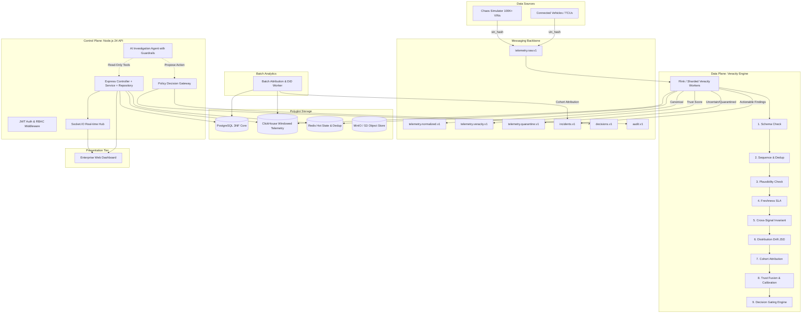

# VISTA Architecture Specification

## 1. System Overview
VISTA (Vehicle Intelligence Signal Trust & Assurance) continuously determines whether connected-vehicle telemetry is trustworthy enough to drive downstream automated decisions.



## 2. Core Pipeline
```
RAW TELEMETRY -> DETECT -> ATTRIBUTE -> QUANTIFY HARM -> TRUST -> DECISION GATE -> ACTION
```

### Attribution Classes
1. `VEHICLE`: Physical vehicle event corroborated across multiple independent signals (e.g. regenerative braking showing coordinated speed drop, battery current spike, and accelerometer decel).
2. `TELEMETRY`: Sensor failure, bus fault, or network corruption (e.g. sudden 400 km/h speed reading while RPM and odometer remain constant).
3. `CONTRACT`: Semantic drift due to unannounced OTA firmware change, unit rescaling (e.g. SoC 0-100 -> 0-1), or enum mutation.
4. `UNKNOWN`: Inconclusive evidence; flagged for human operator review or automated re-sampling.

## 3. High-Level Guarantees
- **LLM Guardrail**: The AI never decides trust. All trust scores, policies, and gate decisions are strictly deterministic and cryptographically auditable.
- **Latency**: Sub-5 second detection on critical signal drift.
- **Throughput**: Scalable to 100,000+ events/second via partitioned Kafka keying (`vin_hash`).
- **Resilience**: Graceful broker/worker shutdown and automatic sequence gap reconciliation.
