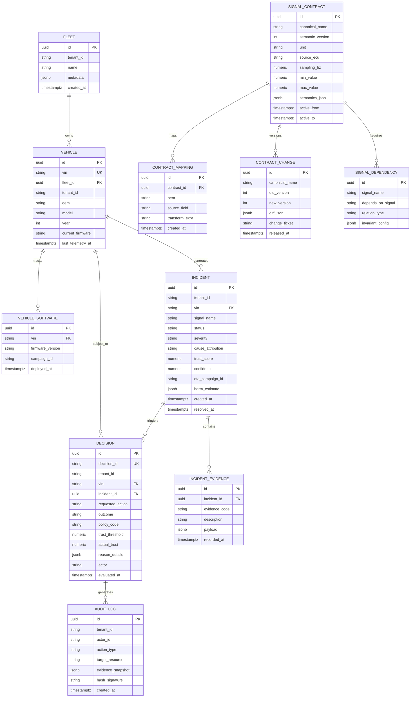

# VISTA Entity-Relationship (ER) & Schema Specification

## 1. Relational 3NF Model (PostgreSQL)



## 2. Columnar Analytics Model (ClickHouse)

```sql
CREATE TABLE telemetry_windowed (
    vin_hash String,
    ts DateTime64(3),
    signal_name LowCardinality(String),
    value Float64,
    trust_score Float32,
    firmware_version LowCardinality(String),
    contract_version LowCardinality(String),
    scenario_id String
)
ENGINE = MergeTree
PARTITION BY toYYYYMMDD(ts)
ORDER BY (vin_hash, ts)
TTL ts + INTERVAL 30 DAY TO VOLUME 'warm',
    ts + INTERVAL 180 DAY DELETE;
```

### Partition & Sort Key Justification
- `ORDER BY (vin_hash, ts)`: Aligns on disk with the primary access pattern: looking up chronological sensor history for a single vehicle during incident investigation and veracity window calculation.
- `PARTITION BY toYYYYMMDD(ts)`: Enables instantaneous drop/detach of old data partitions and isolates high-frequency daily batches.
- `TTL`: Automates multi-tiered cold storage offloading to MinIO/S3 after 30 days and pruning after 180 days.
